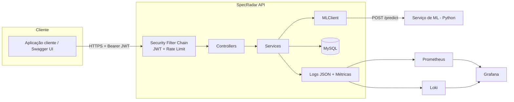
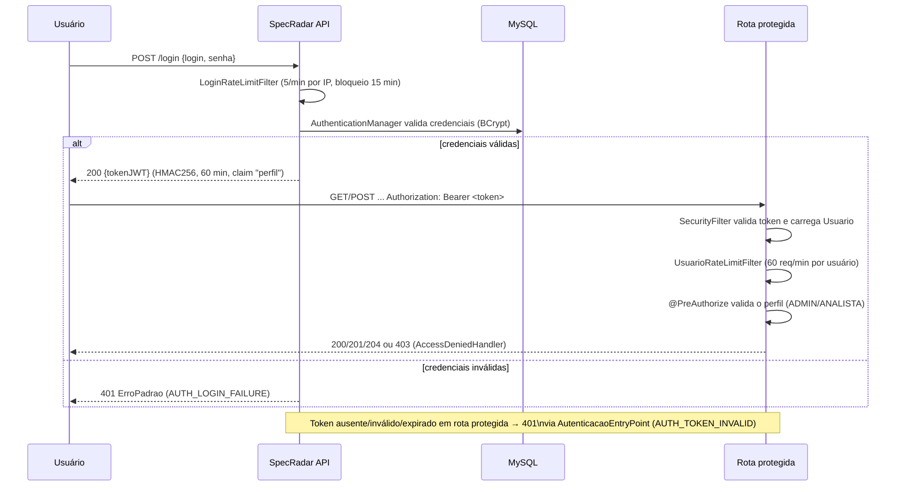

# Participantes
- Eduardo Tomazela do Nascimento rm556807
- Léo Masago rm557768
- Luiz Henrique Silva rm555735

# SpecRadar

API de inteligência competitiva automotiva — Desafio Ford 01, FIAP Sprint 3 (Arquitetura Orientada a Serviços e Web Services).

Recebe marca, modelo, versão e uma lista livre de atributos técnicos e devolve uma **ficha técnica padronizada**, sempre no mesmo formato, mapeando os atributos livres para um catálogo canônico com o auxílio de um serviço de Machine Learning (com fallback determinístico quando o ML está indisponível).

## Visão geral da arquitetura



## Fluxo de autenticação



## Endpoints x perfil

| Método | Rota                     | Público | ADMIN | ANALISTA | Descrição                                     |
|--------|---------------------------|:-------:|:-----:|:--------:|------------------------------------------------|
| POST   | `/login`                  | ✅      | ✅    | ✅       | Autentica e retorna o token JWT                |
| POST   | `/usuarios`               |         | ✅    |          | Cadastra usuário                                |
| GET    | `/usuarios`                |         | ✅    |          | Lista usuários (paginado)                       |
| GET    | `/usuarios/{id}`           |         | ✅    |          | Detalha usuário                                 |
| GET    | `/usuarios/me`             |         | ✅    | ✅       | Dados do usuário autenticado                    |
| PATCH  | `/usuarios/{id}/perfil`    |         | ✅    |          | Altera o perfil (ADMIN/ANALISTA)                |
| DELETE | `/usuarios/{id}`           |         | ✅    |          | Exclusão lógica de usuário                      |
| POST   | `/atributos`                |         | ✅    |          | Cadastra atributo no catálogo canônico          |
| GET    | `/atributos`                |         | ✅    | ✅       | Lista o catálogo de atributos                   |
| GET    | `/atributos/{id}`           |         | ✅    | ✅       | Detalha um atributo                             |
| PUT    | `/atributos/{id}`           |         | ✅    |          | Atualiza um atributo                            |
| DELETE | `/atributos/{id}`           |         | ✅    |          | Exclusão lógica de um atributo                  |
| POST   | `/veiculos`                  |         | ✅    |          | Cadastra veículo e especificações               |
| GET    | `/veiculos`                  |         | ✅    | ✅       | Lista veículos                                  |
| GET    | `/veiculos/{id}`             |         | ✅    | ✅       | Detalha veículo e especificações                |
| PUT    | `/veiculos/{id}`             |         | ✅    |          | Atualiza dados cadastrais do veículo            |
| DELETE | `/veiculos/{id}`             |         | ✅    |          | Exclusão lógica de veículo                      |
| POST   | `/pesquisas`                  |         | ✅    | ✅       | Executa a pesquisa e retorna a ficha técnica    |
| GET    | `/pesquisas`                  |         | ✅    | ✅       | Lista as pesquisas do próprio usuário           |
| GET    | `/pesquisas/{id}`             |         | ✅    | ✅       | Detalha uma pesquisa própria (404 se for de outro usuário) |
| GET    | `/actuator/health`            | ✅      | ✅    | ✅       | Health check                                    |
| GET    | `/actuator/prometheus`        | ✅*     | ✅    | ✅       | Métricas Prometheus (uso interno/monitoramento) |
| GET    | `/swagger-ui.html`            | ✅      | ✅    | ✅       | Documentação interativa (desligada em `prod`)   |

\* Exposto sem autenticação de aplicação para ser raspado pelo Prometheus; em produção deve ficar restrito à rede interna (ver `docker-compose.yml`).

## Formato fixo da ficha técnica

```json
{
  "veiculo": { "marca": "Ford", "modelo": "Ranger", "versao": "Raptor" },
  "especificacoes": [
    {
      "atributoSolicitado": "cavalos",
      "atributoCanonico": "Potência",
      "valor": "292 cv",
      "unidade": "cv",
      "status": "ENCONTRADO",
      "confianca": 0.93
    },
    {
      "atributoSolicitado": "cor do banco",
      "atributoCanonico": "Não disponível",
      "valor": "Não disponível",
      "unidade": "Não disponível",
      "status": "NAO_DISPONIVEL",
      "confianca": 0.41
    }
  ],
  "geradoEm": "2026-09-27T10:15:30"
}
```

## Como rodar

### Docker Compose (recomendado)

1. Copie `.env.example` para `.env` e preencha os segredos (`JWT_SECRET`, senhas de admin/analista, senha do Grafana etc.).
2. Preencha `dados/ranger-raptor.json` com os dados da ficha técnica da Ford Ranger Raptor (slide da Ford) — o arquivo é montado no container e lido pelo seed na inicialização.
3. Suba a stack:

```bash
docker compose --env-file .env up --build
```

Serviços disponíveis:

- API: http://localhost:8080 (Swagger em `/swagger-ui.html`, desligado se `SPRING_PROFILES_ACTIVE=prod`)
- Prometheus: http://localhost:9090
- Grafana: http://localhost:3000 (dashboards **Segurança** e **Operação e ML** já provisionados)
- Loki: http://localhost:3100 (consumido pelo Grafana via Promtail)

### Local (sem Docker)

Pré-requisitos: JDK 25, Maven, MySQL local com o schema `specradar` criado.

```bash
export JWT_SECRET="um-segredo-bem-forte"
export ADMIN_PASSWORD="senha-do-admin"
export ANALISTA_PASSWORD="senha-do-analista"
export DB_PASSWORD="senha-do-mysql"

mvn spring-boot:run
```

## Variáveis de ambiente

| Variável              | Obrigatória | Padrão                          | Descrição                                   |
|------------------------|:-----------:|----------------------------------|----------------------------------------------|
| `JWT_SECRET`           | ✅          | —                                 | Segredo HMAC256 para assinatura do JWT        |
| `DB_HOST`              |             | `localhost`                       | Host do MySQL                                 |
| `DB_PORT`              |             | `3306`                            | Porta do MySQL                                |
| `DB_NAME`              |             | `specradar`                       | Schema do MySQL                               |
| `DB_USERNAME`          |             | `root`                            | Usuário do MySQL                              |
| `DB_PASSWORD`          |             | vazio                             | Senha do MySQL                                |
| `ADMIN_LOGIN`          |             | `admin@specradar.com`             | Login do usuário ADMIN semeado                |
| `ADMIN_PASSWORD`       | ✅          | —                                 | Senha (BCrypt) do usuário ADMIN semeado       |
| `ANALISTA_LOGIN`       |             | `analista@specradar.com`          | Login do usuário ANALISTA semeado             |
| `ANALISTA_PASSWORD`    | ✅          | —                                 | Senha (BCrypt) do usuário ANALISTA semeado    |
| `ML_URL`               |             | `http://localhost:8000`           | URL base do serviço de ML                     |
| `ML_TIMEOUT_MS`        |             | `5000`                            | Timeout (ms) do cliente HTTP do ML            |
| `RANGER_RAPTOR_PATH`   |             | `dados/ranger-raptor.json`        | Caminho do arquivo de seed do veículo de validação |
| `ALLOWED_ORIGINS`      |             | `http://localhost:5500,...`       | Origens permitidas pelo CORS                  |
| `SPRING_PROFILES_ACTIVE` |           | (nenhum)                          | Use `prod` para desligar Swagger e detalhes de erro |

## Como rodar os testes

```bash
mvn test
```

O relatório de testes (JUnit + MockMvc + spring-security-test, banco H2 em memória no profile `test`) fica em `target/surefire-reports`.

Cobertura: login com sucesso/erro, validação (400), acesso sem token/token expirado (401), perfil sem permissão (403), BOLA em pesquisas de outro usuário (404), rate limit (429) e a pesquisa completa retornando o formato fixo da ficha técnica.

## Observabilidade e segurança

- Logs estruturados em JSON (`logstash-logback-encoder`), com `traceId` por requisição via MDC e login sempre mascarado — nunca senha ou token em log.
- Eventos de negócio/segurança: `AUTH_LOGIN_SUCCESS`, `AUTH_LOGIN_FAILURE`, `AUTH_TOKEN_INVALID`, `ACCESS_DENIED`, `RATE_LIMIT_EXCEEDED`, `USER_ROLE_CHANGED`, `ATTRIBUTE_CATALOG_CHANGED`, `SPEC_SEARCH_EXECUTED`, `SOURCE_FETCH_FAILED`.
- Métricas Micrometer/Prometheus: `specradar_auth_login_failure_total{ip}`, `specradar_rate_limit_exceeded_total`, `specradar_role_changes_total`, `specradar_source_fetch_errors_total`.
- Alertas Prometheus: mais de 10 falhas de login do mesmo IP em 5 min, taxa de 5xx acima de 5%, p95 acima de 2s, serviço fora do ar por mais de 1 min (`docker/prometheus/alert-rules.yml`).
- `scripts/simular-ataque.sh` gera força bruta em `/login`, acessos sem permissão e carga normal para gerar prints dos dashboards e alertas.

## DevSecOps

`.github/workflows/ci.yml` roda build + testes, Gitleaks (segredos), CodeQL (SAST), OWASP Dependency-Check (falha com CVSS ≥ 7) e Trivy na imagem Docker. `.github/dependabot.yml` mantém Maven, Docker e GitHub Actions atualizados semanalmente.
